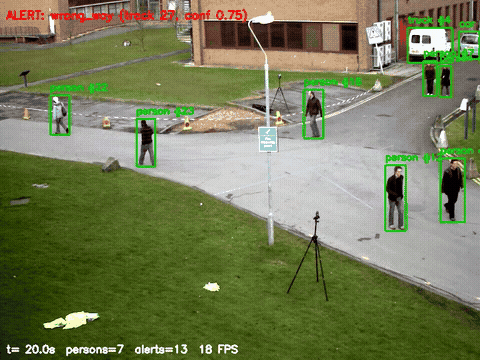
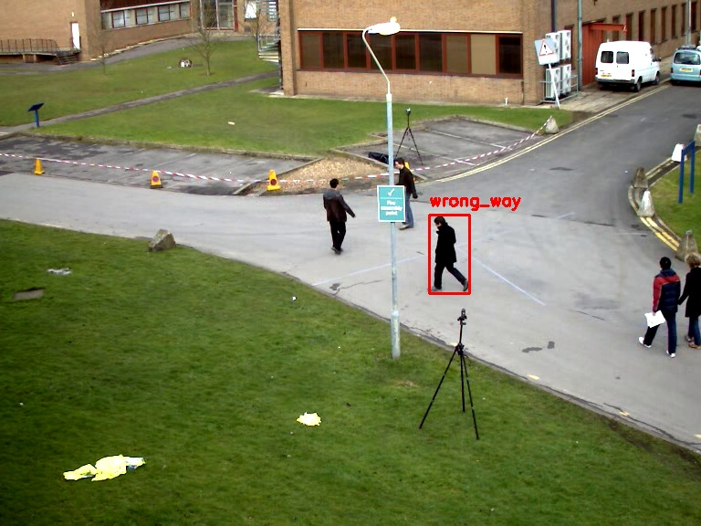
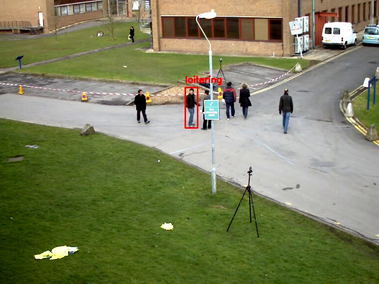
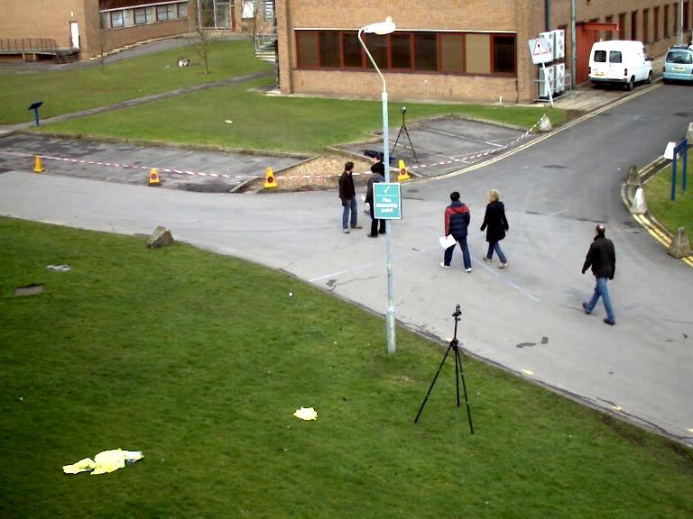
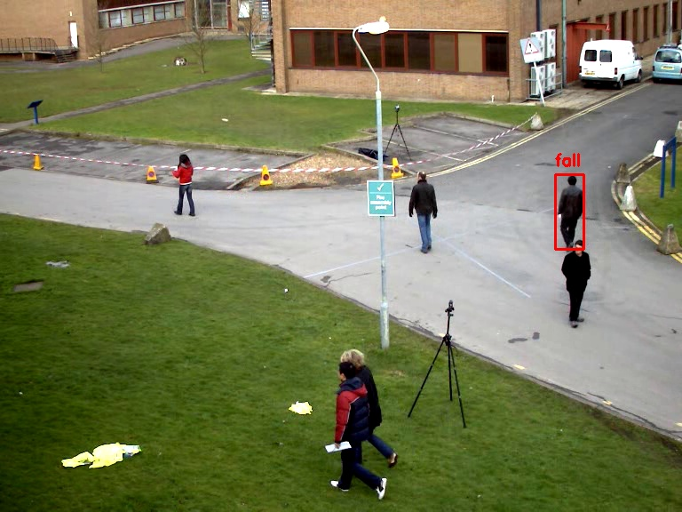

<div align="center">

# 🎥 Sentinel

### Multi-Camera Real-Time Video Anomaly Detection

*Detects and tracks people, vehicles and bags across multiple video sources, then raises
structured, deduplicated alerts (falls, loitering, abandoned objects, crowd density,
wrong-way movement) with thumbnails, clips, Prometheus metrics and a Streamlit dashboard.*

[](https://www.python.org/)
[](https://github.com/ultralytics/ultralytics)
[](https://opencv.org/)
[](https://prometheus.io/)
[](LICENSE)

[Verified run](#verified-run-2026-09-15) · [Architecture](#architecture) · [Quickstart](#quickstart) · [Configuration](#configuration)



</div>

---

## Verified run (2026-09-15)

I ran the test suite, an offline render, the FPS benchmark, the live headless CLI and
a soak test on a Linux GPU server, and every stage finished successfully. Raw outputs
are in [`demo_outputs/`](demo_outputs/).

**Environment:** Python 3.11 (conda), `torch 2.4.1+cu121`, `ultralytics 8.4.152`,
`opencv 4.11.0`, NVIDIA RTX A5000. Weights: pretrained `yolov8n.pt` (COCO, no fine-tuning).
**Footage:** OpenCV's `samples/data/vtest.avi`: 795 frames, 768×576, 10 fps, a
pedestrian plaza filmed from above.

| Stage | What ran | Result |
|---|---|---|
| Tests | `pytest -v` | **17 passed** (0.4 s) |
| FPS benchmark | `scripts/benchmark_fps.py --weights yolov8n.pt --device 0 --frames 300` (ByteTrack) | **32.3 FPS** (300 frames in 9.29 s) |
| Offline render, default thresholds | YOLOv8n + BoT-SORT + RuleEngine + overlay, every frame | **19.7 FPS** (50.8 ms/frame), 27 alerts |
| Offline render, demo thresholds | same, with time windows scaled for a 80 s clip | 18.0 FPS (55.7 ms/frame), 35 alerts |
| Live CLI | `python -m sentinel.main --headless` on 2 file sources for 90 s | vtest **18.1 FPS**, synthetic clip **33.3 FPS**, stream lag 21–26 ms, 1 alert + clip + thumbnail written |
| Soak test | `scripts/stress_test.py --duration 3m` | 3,268 steps, **0 exceptions**, memory +2.7 MB (2056 → 2059 MB), ~100 % uptime |

### Detection and tracking on vtest

| | Default profile | Demo profile |
|---|---|---|
| Unique tracks | 34 person, 3 car, 2 truck | 34 person, 3 car, 2 truck |
| Max persons in one frame | 9 | 9 |
| `wrong_way` | 26 | 28 |
| `loitering` | 0 | 5 |
| `crowd_density` | 0 | 1 |
| `fall` | 1 (false positive) | 1 (false positive) |
| `abandoned_object` | 0 | 0 |

The shipped thresholds (30 s loitering, 30 s crowd, 5 min abandoned bag) can't fire inside
an 80-second clip, so the **demo profile** scales them down: loitering 6 s / 50 px, crowd ≥ 6
people for 3 s, wrong-way persistence 1.5 s, abandoned object 10 s. Both runs use the same
detector and tracker.

| Wrong-way | Loitering | Crowd density |
|---|---|---|
|  |  |  |

### Honest reading of the results

- **The fall alert is a false positive.** Track 46 at frame 529 (52.9 s) is a person walking
  upright who is partly hidden behind another pedestrian. The bounding-box aspect ratio
  dropped 55.6 % for 2.2 s while speed stayed under the 40 px/s threshold, so every fall
  condition was met.
  
  This is the known weakness of a box-geometry fall rule under occlusion. A pose-based check,
  or requiring the box's bottom edge to stay fixed, would suppress it.
- **Wrong-way counts reflect configuration, not failures.** `expected_flow_deg` was `0`
  (left→right) for vtest, but pedestrians there walk both ways, so almost everyone walking
  right-to-left (heading ≈ 170–215°) is flagged. On a real camera, set the flow per ROI or
  disable the rule for bidirectional scenes.
- **Throughput depends on what's measured.** 32 FPS is detector + ByteTrack only. The
  18–20 FPS renders add BoT-SORT's ReID/GMC, the rule engine and drawing, all at 768×576
  with `yolov8n` on one A5000. Larger weights or more streams will be slower.
- **GMC warnings in the soak log.** BoT-SORT's global motion compensation raised
  `GMC failed, falling back to identity` 1,633 times in 3 minutes. The two sources had
  different resolutions (768×576 and 640×480). The likely cause is tracker state carried
  between them, since `model.track(persist=True)` keeps one tracker per model. No
  exceptions resulted, but for multi-camera use give each source its own model or tracker
  instance so IDs and motion compensation don't mix.
- **Not measured:** MOTA/IDF1 or mAP (needs MOT17/COCO eval harnesses, see
  [ROADMAP.md](ROADMAP.md)), RTSP/webcam sources, the Streamlit dashboard, Docker, and
  the Tier 2 action-recognition and LSTM models.

---

## What it does

- **Multi-source ingestion**: webcam, video file or RTSP, each on its own capture thread with reconnection.
- **Detection + tracking**: YOLOv8 detects people, vehicles and bags. BoT-SORT (or ByteTrack) keeps persistent IDs through short occlusions.
- **Rule-based anomaly detection**: each anomaly must *persist* before it alerts:
  - **Fall**: bounding-box aspect-ratio collapse with near-zero velocity, sustained.
  - **Loitering**: a track staying within a small radius for too long.
  - **Abandoned object**: a bag stationary with no person nearby.
  - **Crowd density**: too many people in a region, sustained.
  - **Wrong-way**: heading deviates from the configured expected flow.
- **Alerts**: deduplicated per track + event, severity-scored, with a thumbnail and ±N s clip, stored in SQLite.
- **Dashboard** (Streamlit): live grid, alert history with clip playback, CSV export, analytics.
- **Metrics**: Prometheus `inference_fps`, `alert_count`, `stream_lag_seconds`, `frames_processed` at `/metrics`.

## Architecture

```
 Webcam/File/RTSP ──▶ StreamManager (per-source thread, reconnect, rolling frame buffer)
                              │
                              ▼
                     YOLOv8 detect + BoT-SORT track (persistent IDs)
                              │
                              ▼
                     TrajectoryStore (per-track position/size history)
                              │
                              ▼
          RuleEngine: fall · loitering · abandoned-object · crowd · wrong-way
                              │
                              ▼
     AlertManager: dedup → severity → thumbnail + clip → SQLite ──▶ Streamlit dashboard
                              │
                              ▼
                  Prometheus metrics (fps, alert_count, stream_lag)
```

## Quickstart

```bash
python -m venv .venv && source .venv/bin/activate    # Windows: .venv\Scripts\activate
pip install -e ".[dev]"
pytest                                   # 17 tests, no GPU or weights needed
python scripts/make_sample_clips.py      # synthetic demo clips
python -m sentinel.main --config config  # one OpenCV window per source, q to quit
python -m sentinel.main --config config --headless --metrics-port 9187   # servers
streamlit run sentinel/dashboard/app.py
```

`yolov8n.pt` (~6 MB) downloads on first run. On a GPU box, install the CUDA build of torch
first (`pip install torch==2.4.1 torchvision==0.19.1`).

### Benchmark and soak test

```bash
python scripts/benchmark_fps.py --source path/to/video.avi --weights yolov8n.pt --device 0 --frames 300
python scripts/stress_test.py --duration 3m --config config --sample-interval-sec 20
```

### Reproduce the verified run

The exact scripts are in [`demo_outputs/run_scripts/`](demo_outputs/run_scripts/).
`render_demo.py` drives the same `YoloEngine`, `TrajectoryStore`, `RuleEngine` and
`draw_overlay` frame by frame on *video time*. `sentinel.main --headless` paces to
wall-clock and doesn't save video. The script writes the annotated MP4, GIF, thumbnails and `summary.json`:

```bash
python demo_outputs/run_scripts/render_demo.py --source vtest.avi --out demo_outputs/vtest_demo_profile --profile demo
python demo_outputs/run_scripts/render_demo.py --source vtest.avi --out demo_outputs/vtest_default_profile --profile default --gif-seconds 0
```

The headless live run used `demo_outputs/live_config/`, a copy of `config/` with both
sources switched to files and storage paths redirected.

## Configuration

- [config/cameras.yaml](config/cameras.yaml): sources, ROIs, `expected_flow_deg` per camera.
- [config/models.yaml](config/models.yaml): YOLO weights, confidence, classes, tracker, frame skip.
- [config/alerts.yaml](config/alerts.yaml): per-rule thresholds, severity mapping, dedup window, clip length, storage paths.

## Why this design

- **Detection vs. understanding.** Per-frame boxes are easy. Turning them into per-track
  *behaviour* is the hard part: trajectories, persistence, multi-signal fusion. The fall
  false positive above shows why that fusion matters.
- **Tracking is the hard part.** `sentinel/tracking/bot_sort_wrapper.py` explains why the
  maintained BoT-SORT (Kalman + ReID) is used instead of a reimplementation.
- **Rules first, learning later.** Rules need no training data and are interpretable. The
  LSTM autoencoder (Tier 2) covers anomalies no rule anticipates, once normal-behaviour
  data exists.
- **Scope honesty.** [REVISED_PLAN.md](REVISED_PLAN.md) documents what changed from the
  original 6–8 week spec. [ROADMAP.md](ROADMAP.md) lists what needs datasets or hardware.

## License

MIT — see [LICENSE](LICENSE). YOLOv8 weights are AGPL-3.0 (Ultralytics).
